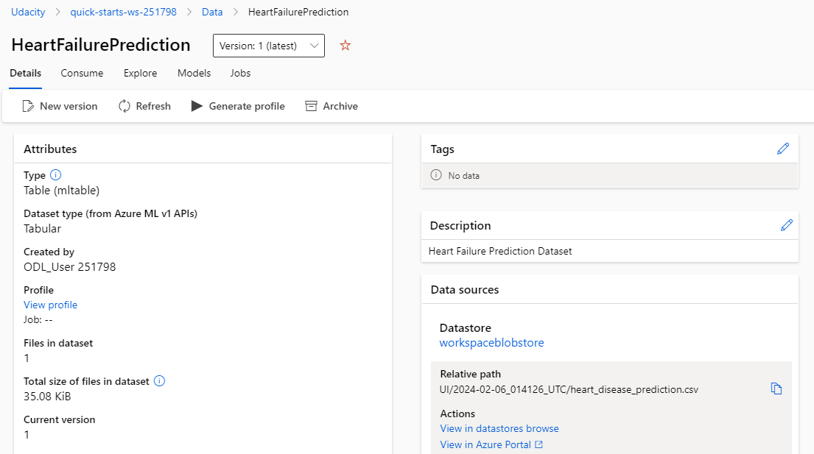

*NOTE:* This file is a template that you can use to create the README for your project. The *TODO* comments below will highlight the information you should be sure to include.

# Heart Failure Prediction
Cardiovascular diseases (CVDs) are the number 1 cause of death globally, taking an estimated 17.9 million lives each year, which accounts for 31% of all deaths worldwide. Four out of 5CVD deaths are due to heart attacks and strokes, and one-third of these deaths occur prematurely in people under 70 years of age. Heart failure is a common event caused by CVDs and this dataset contains 11 features that can be used to predict a possible heart disease.

People with cardiovascular disease or who are at high cardiovascular risk (due to the presence of one or more risk factors such as hypertension, diabetes, hyperlipidaemia or already established disease) need early detection and management wherein a machine learning model can be of great help.

## Project Set Up and Installation
*OPTIONAL:* If your project has any special installation steps, this is where you should put it. To turn this project into a professional portfolio project, you are encouraged to explain how to set up this project in AzureML.

## Dataset

### Overview
*TODO*: Explain about the data you are using and where you got it from.
The dataset used for the project is the [Heart Failure Prediction](https://www.kaggle.com/datasets/fedesoriano/heart-failure-prediction/data) dataset from Kaggle.The anonymized data was collected from multiple hospitals on several patients to predict the likelihood of a new patient having heart disease in the future. The dataset includes relevant information for each patient, such as personal information and medical data, including whether or not they have had heart disease before.

Attribute Information
* Age: age of the patient [years]
* Sex: sex of the patient [M: Male, F: Female]
* ChestPainType: chest pain type [TA: Typical Angina, ATA: Atypical Angina, NAP: Non-Anginal Pain, ASY: Asymptomatic]
* RestingBP: resting blood pressure [mm Hg]
* Cholesterol: serum cholesterol [mm/dl]
* FastingBS: fasting blood sugar [1: if FastingBS > 120 mg/dl, 0: otherwise]
* RestingECG: resting electrocardiogram results [Normal: Normal, ST: having ST-T wave abnormality (T wave inversions and/or ST elevation or depression of > 0.05 mV), LVH: showing probable or definite left ventricular hypertrophy by Estes' criteria]
* MaxHR: maximum heart rate achieved [Numeric value between 60 and 202]
* ExerciseAngina: exercise-induced angina [Y: Yes, N: No]
* Oldpeak: oldpeak = ST [Numeric value measured in depression]
* ST_Slope: the slope of the peak exercise ST segment [Up: upsloping, Flat: flat, Down: downsloping]
* HeartDisease: output class [1: heart disease, 0: Normal]

### Task
*TODO*: Explain the task you are going to be solving with this dataset and the features you will be using for it.
We will build a model to accurately predict the likelihood of a new patient having heart disease in the future.

### Access
*TODO*: Explain how you are accessing the data in your workspace.
The dataset was created in AzureML studio by uploading the local file. The code to utilize KaggleDatasetFactory is included in the Notebook.

## Automated ML
*TODO*: Give an overview of the `automl` settings and configuration you used for this experiment

AutoML config utilized the compute cluster that was created to perform classification utlizing the dataset with 'HeartDisease' as the column to predict. The experiment timeout was set to 20 mins with max concurrent iterations set to 5 to best utilize the compute cluster. The primary metric was accuracy.

### Results
*TODO*: What are the results you got with your automated ML model? What were the parameters of the model? How could you have improved it?
#### AutoML Run In Progress

#### AutoML Run Complete

*TODO* Remeber to provide screenshots of the `RunDetails` widget as well as a screenshot of the best model trained with it's parameters.
#### Best Model 

## Hyperparameter Tuning
*TODO*: What kind of model did you choose for this experiment and why? Give an overview of the types of parameters and their ranges used for the hyperparameter search
KNeighborsClassifier was used with HeartFailurePrediction dataset. The classifier assigns the object to the class most common among its k nearest neighbors (k is a positive integer). Default values are as follow:
- n_neighbors: 5
- weights: 'uniform'
- algorithm: 'auto'
- leaf_size: 30
- p: 2
- metric: 'minkowski'
- metric_params: None
- n_jobs: None

The parameters used for Hypertuning
- '--n_neighbors': choice(7, 9, 12),  
- '--weights': choice('uniform', 'distance'),  
- '--metric': choice('euclidean', 'manhattan', 'chebyshev', 'minkowski')  

### Results
*TODO*: What are the results you got with your model? What were the parameters of the model? How could you have improved it?
#### Hyperdrive Run In Progress

#### Hyperdrive Run Complete

*TODO* Remeber to provide screenshots of the `RunDetails` widget as well as a screenshot of the best model trained with it's parameters.

#### Hyperdrive Results

#### Hyperdrive Best Run

### Register the best model

## Model Deployment
*TODO*: Give an overview of the deployed model and instructions on how to query the endpoint with a sample input.

Best Model from AutoML was deployed as it had the best accuracy.
#### Register the best model

#### Deploy the best model

## Screen Recording
*TODO* Provide a link to a screen recording of the project in action. Remember that the screencast should demonstrate:
- A working model
- Demo of the deployed  model
- Demo of a sample request sent to the endpoint and its response

## Standout Suggestions
*TODO (Optional):* This is where you can provide information about any standout suggestions that you have attempted.
